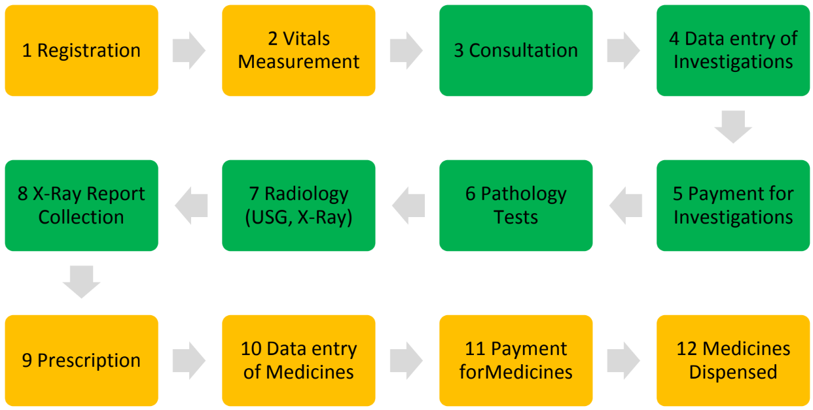

# Finding the critical path

## Motivation and overview

One of the key analytical measures of a project is its critical path, or CP—the longest path from start to finish. Tasks on the CP have to be closely monitored; delays in the CP delay the entire project. The CP itself has to be monitored—complex projects have dynamic CPs.&#x20;

We have used several off-the-shelf project management tools, both with and without CP calculation. Those that did have it, did not perform to our satisfaction. We were left wondering—what's under the hood?&#x20;

Recently, we developed an in-house project management platform, [Feeta](https://www.thelattice.in/projects/feeta). One of its features is to calculate CP. It performed to our satisfaction, and handled tricky real-world scenarios with aplomb.

At its heart lies the Bellman-Ford (BF) algorithm.

This post presents our understanding of the BF algorithm. If you want a more thorough analytical grounding, please check out the [resources](finding-the-critical-path.md#resources-for-self-study) mentioned at the end this post. That is where we started.

This post introduces basic terms used in graph theory, and works through an example step-by-step, so that the iterative nature of the BF algorithm can be more clearly understood. Finally, we provide pseudocode and python code from other internet resources.&#x20;

## Setup

We start with a project that has tasks with durations and dependencies. There are multiple paths from start `s` to finish `f`. The longest path, or the critical path, is `{s,k,h,i,m,n,f}`, totalling 15 days.

<figure><figcaption><p>Figure 1: task durations and connections</p></figcaption></figure>

Graph theory can be applied to analyze such a diagram—each task is treated as a _**vertex**_, and each dependency is an _**edge**_.

Projects can be thought of _**weighted, directed, acyclic graphs**_, commonly abbreviated as weighted DAGs.  _**Weights**_ represent any numeric property of an edge; here, we use task duration. _**Directed**_ graphs are unidirectional—we move only from predecessors to successors, from `s` to `a`; never the other way. And _**acyclic**_ graphs do not have cycles, or loops.

To analyze projects, we assign weights equal to the task duration to each of the edges, so that path length converts to project duration. To find the CP, we need an algorithm that finds the longest path.

### Inverting weights

The Bellman-Ford algorithm searches for the shortest path in a graph. But the critical path is the longest. Therefore, we invert the signs of all weights, so that a task of weight (duration) `2` days is represented as `-2`. Consequently, the path with the highest negative value is selected as the shortest: the critical path.

### Assigning weights to edges

Before we find the longest path, we have to assign weights to edges. If we assign the duration of task `v` to the edge `{v,w}` that connects to the successor `w`, figure 1 transforms into figure 2.

<figure><figcaption><p>Figure 2: Vertices and weighted edges</p></figcaption></figure>

Task `a` is 2 days long, and is followed by task `b`. Thus, we set edge length `C(a,b)` equal to the duration of task `a`. We could also calculate `C(a,b)` by the difference in start dates:

`startDiff = startDate(a)-startDate(b)`

While convenient, the start-date-difference method is flawed, because it includes any slack between `a` and `b` as a part of the path length. This defeats the purpose of finding the longest path.

However, startDiff is a useful parameter to optimize our calculations. Concretely,

1. If b is a task, then  `C(a,b) = min (startDiff(a,b), Duration(a))`&#x20;
2. If b is a milestone, then `C(a,b) = Duration(a)`

This formula accommodates cases where a task finishes on the same day as its successor. In such cases, the duration is one day, but `startDiff` is zero. It also accommodates milestones that are achieved as soon as a task ends, including the project end milestone.

### Example

<figure><figcaption><p>Figure 3: A sample gantt with four sequential tasks</p></figcaption></figure>

In the example above, only path is the critical path. It is 1 + 4 + 1 = 6 days long, including weekends/ holidays.

Holidays have been intentionally included. Once we calculate the project duration—7 calendar days—we can compare it to the critical path length of 6 calendar days, and infer that the critical path has one day of slack. As we can see, there is a day of slack between the third and fourth tasks.

### Bellman-Ford Algorithm

#### Notation

Before we move to the algorithm, let us formalize notation:

`n` = number of vertices. In the context of a gantt, this is the number of tasks.

`m` = number of edges. In the context of a gantt, this is the number of dependencies.

`s` = source vertex, `f` = destination vertex (i.e. the starting and finishing tasks)

`v` = any vertex

`e` = any edge&#x20;

`L(i,v)` = minimum length of a path from s to v, where i represents the number of hops.

`i ∈ {0, 1, 2, … n-1}`, because the longest possible path is one that touches all the vertices once.

`C(v,w)` = path length between two vertices connected by an edge, v and w

#### Outer loop

We iterate through an outer loop a maximum of n-1 times, because an acyclic (no loops) path can, at most, pass through each vertex once. And a path passing through all n vertices has n-1 segments, or hops. In our example, n=14, hence there are a maximum of 13 outer loop iterations. However, because our graphs are sparse — most vertices have one or two inbound edges — we usually need fewer iterations.

#### Inner loop

Within each outer loop, we examine all available next steps, and “take the next step” wherever we find that it is a shorter path to a vertex. “Taking the next step” consists of 2 actions — updating the distance to the vertex, and adding the new vertex to the array that stores the path.

Hence, we execute the following inner loop:

```
for each edge (u, v) with weight w in edges do
    if distance[u] + w < distance[v]    // is it faster to get to v via w?
    then
        distance[v] := distance[u] + w  // update distance[v]
        predecessor{s, … ,u} := {s, … u, v} // predecessor array updated
return distance, predecessor
```

#### Base case, i=0

`i=0` means that there are zero segments, i.e. no hops—hence we can only get from s to s.&#x20;

Therefore, `L(0,s) = 0`, representing a path of zero length from the starting vertex to itself.

Also, we set `L(0,v) = ∞` for all other vertices, because we cannot reach any of them in zero hops. Operationally, we can use a sufficiently large number instead of infinity, as long as it is guaranteed to always be larger than any task’s duration (in days).

Thus, the distance array for the zeroth iteration is:

| iter | s | a | b | c | d | e | k | g | h | i | j | m | n | f |
| ---- | - | - | - | - | - | - | - | - | - | - | - | - | - | - |
| 0    | 0 | ∞ | ∞ | ∞ | ∞ | ∞ | ∞ | ∞ | ∞ | ∞ | ∞ | ∞ | ∞ | ∞ |

\## Iteration 1, i=1

Previously computed vertices in red, vertices computed in this iteration in yellow, and unchanged vertices in blue.

| <p>paths and their lengths:</p><p>sk: L(1,k) = 0</p><p>sa: L(1,a) = 0</p> |
| ------------------------------------------------------------------------- |

<figure><figcaption></figcaption></figure>

Distance array:

```
iter | s | a | b | c | d | e | k | g | h | i | j | m | n | f
----- --- --- --- --- --- --- --- --- --- --- --- --- --- --- 
1    | 0 | 0 | ∞ | ∞ | ∞ | ∞ | 0 | ∞ | ∞ | ∞ | ∞ | ∞ | ∞ | ∞
```

| iter | s | a | b | c | d | e | k | g | h | i | j | m | n | f |
| ---- | - | - | - | - | - | - | - | - | - | - | - | - | - | - |
| 1    | 0 | 0 | ∞ | ∞ | ∞ | ∞ | 0 | ∞ | ∞ | ∞ | ∞ | ∞ | ∞ | ∞ |

\
Iteration 2

| <p>paths and path lengths:</p><p>skh: L(2,h) = -1</p><p>skg: L(2,g) = -1</p><p>sab: L(2,b) = -2</p> |
| --------------------------------------------------------------------------------------------------- |

\


| iter | s | a | b  | c | d | e | k | g  | h  | i | j | m | n | f |
| ---- | - | - | -- | - | - | - | - | -- | -- | - | - | - | - | - |
| 2    | 0 | 0 | -2 | ∞ | ∞ | ∞ | 0 | -1 | -1 | ∞ | ∞ | ∞ | ∞ | ∞ |

#### Iteration 3

| <p>paths and lengths:</p><p>skhi: -2</p><p>skgd: -1</p><p>sabc: -5</p><p>sabe: -5</p> |
| ------------------------------------------------------------------------------------- |

\
\
\


| iter | s | a | b  | c  | d  | e  | k | g  | h  | i  | j | m | n | f |
| ---- | - | - | -- | -- | -- | -- | - | -- | -- | -- | - | - | - | - |
| 3    | 0 | 0 | -2 | -5 | -2 | -5 | 0 | -1 | -1 | -2 | ∞ | ∞ | ∞ | ∞ |

\
\


#### Iteration 4

```
paths and lengths:
skhim: -5
skhij: -5
skgde: -3
sabcd: -7
sabef: -7
```

\
\


| iter | s | a | b  | c  | d  | e  | k | g  | h  | i  | j  | m  | n | f  |
| ---- | - | - | -- | -- | -- | -- | - | -- | -- | -- | -- | -- | - | -- |
| 4    | 0 | 0 | -2 | -5 | -7 | -8 | 0 | -1 | -1 | -2 | -5 | -5 | ∞ | -7 |

\


#### Iteration 5

| <p>paths and lengths:</p><p>skhimn: -12</p><p>skhijn: -12</p><p>skgdef: -5</p><p>sabcde: -8</p><p>sabef: -7 // no change, reached finish in prior iteration </p> |
| ---------------------------------------------------------------------------------------------------------------------------------------------------------------- |

\
\


| iter | s | a | b  | c  | d  | e  | k | g  | h  | i  | j  | m  | n   | f  |
| ---- | - | - | -- | -- | -- | -- | - | -- | -- | -- | -- | -- | --- | -- |
| 5    | 0 | 0 | -2 | -5 | -7 | -8 | 0 | -1 | -1 | -2 | -5 | -5 | -12 | -7 |

\


#### Iteration 6

```
paths and path lengths:
skhimnf: -15
skhijnf: -10 // distance(f) not updated
skgdef: -5 // no change, reached finish
sabcdef: -9
sabef: -7 // no change, reached finish
```

Thus, the algorithm finds five paths from start to finish. The path with the least value, `skhimnf`, is longest path, or the critical path.&#x20;

### Iterations summarized

Here is the distance array through all the iterations.&#x20;

<table data-header-hidden data-full-width="true"><thead><tr><th>iter</th><th width="48">s</th><th width="48">a</th><th width="48">b</th><th width="48">c</th><th width="48">d</th><th width="48">e</th><th width="48">k</th><th width="48">g</th><th width="48">h</th><th width="48">i</th><th width="48">j</th><th width="48">m</th><th width="48">n</th><th width="48">f</th></tr></thead><tbody><tr><td>iter</td><td>s</td><td>a</td><td>b</td><td>c</td><td>d</td><td>e</td><td>k</td><td>g</td><td>h</td><td>i</td><td>j</td><td>m</td><td>n</td><td>f</td></tr><tr><td>0</td><td>0</td><td>∞</td><td>∞</td><td>∞</td><td>∞</td><td>∞</td><td>∞</td><td>∞</td><td>∞</td><td>∞</td><td>∞</td><td>∞</td><td>∞</td><td>∞</td></tr><tr><td>1</td><td>0</td><td>0</td><td>∞</td><td>∞</td><td>∞</td><td>∞</td><td>0</td><td>∞</td><td>∞</td><td>∞</td><td>∞</td><td>∞</td><td>∞</td><td>∞</td></tr><tr><td>2</td><td>0</td><td>0</td><td>-2</td><td>∞</td><td>∞</td><td>∞</td><td>0</td><td>-1</td><td>-1</td><td>∞</td><td>∞</td><td>∞</td><td>∞</td><td>∞</td></tr><tr><td>3</td><td>0</td><td>0</td><td>-2</td><td>-5</td><td>-2</td><td>-5</td><td>0</td><td>-1</td><td>-1</td><td>-2</td><td>∞</td><td>∞</td><td>∞</td><td>∞</td></tr><tr><td>4</td><td>0</td><td>0</td><td>-2</td><td>-5</td><td>-7</td><td>-8</td><td>0</td><td>-1</td><td>-1</td><td>-2</td><td>-5</td><td>-5</td><td>∞</td><td>-7</td></tr><tr><td>5</td><td>0</td><td>0</td><td>-2</td><td>-5</td><td>-7</td><td>-8</td><td>0</td><td>-1</td><td>-1</td><td>-2</td><td>-5</td><td>-5</td><td>-12</td><td>-7</td></tr><tr><td>6</td><td>0</td><td>0</td><td>-2</td><td>-5</td><td>-7</td><td>-8</td><td>0</td><td>-1</td><td>-1</td><td>-2</td><td>-5</td><td>-5</td><td>-12</td><td>-15</td></tr></tbody></table>

The algorithm terminates in iteration 6 because all paths have reached the finish point.

<figure><figcaption><p>BF algorithm computes all paths and path lengths</p></figcaption></figure>

At the end of iteration 6, we also have all paths available as a set of arrays.

### Pseudocode

Source: [Wikipedia](https://en.wikipedia.org/wiki/Bellman%E2%80%93Ford_algorithm)

```
function BellmanFord(list vertices, list edges, vertex source) is

    // This implementation takes in a graph, represented as
    // lists of vertices (represented as integers [0..n-1]) and edges,
    // and fills two arrays, distance and predecessor, holding
    // the shortest path from the source to each vertex

    distance := list of size n
    predecessor := list of size n

    // Step 1: initialize graph
    for each vertex v in vertices do
        distance[v] := inf     // Initialize distance to all vertices to ∞
        predecessor[v] := null // And having a null predecessor
    
    distance[source] := 0      // Distance from the source to itself is zero

    // Step 2: updated distance and predecessors repeatedly
    repeat V−1 times:          // V = number of vertices (tasks)
         for each edge (u, v) with weight w in edges do
             if distance[u] + w < distance[v] 
             then
                 distance[v] := distance[u] + w  // distance list updated
                 predecessor[v] := u    // predecessor list updated
    return distance, predecessor
```

### Python implementation&#x20;

A python implementation is available in [Programiz.com](https://www.programiz.com/dsa/bellman-ford-algorithm); it does not print the path. You can [try out this code on Replit](https://replit.com/@SouraBhattacha2/BellmanFordAlgo#main.py), with the following inputs:

```
g = Graph(5)
g.add_edge(0, 1, 5)
g.add_edge(0, 2, 4)
g.add_edge(1, 3, 3)
g.add_edge(2, 1, 6)
g.add_edge(3, 2, 2)

g.bellman_ford(0)
```

The output is:

```
Vertex Distance from Source
0       0
1       5
2       4
3       8
4       inf
```

## Resources for self-study

* [Algorithms: Design and Analysis, Part 2 | edX](https://learning.edx.org/course/course-v1:StanfordOnline+SOE-YCSALGORITHMS2+1T2020/home) > The Bellman-Ford Algorithm: This is a Stanford undergraduate course, available for free on edX.
* [Algorithms, Part II | Coursera](https://in.coursera.org/learn/algorithms-part2#syllabus) > Shortest Paths: This is a Princeton undergraduate course, available for free on Coursera. It includes guidance for java implementation.
