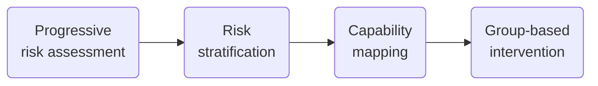
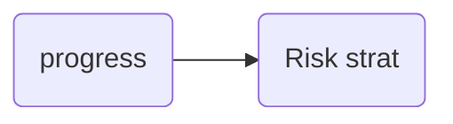

# Part I: Conceptual framework

Progressive risk assessment

Our health status is analog, not digital. We do not transition from “at-risk of hypertension” to “confirmed hypertensive” overnight. To accurately assess our health, we need a model that measures risk progressively. The evidence used to build a risk model can be split into two dimensions — its source, and its nature.

### Source of evidence

* Patient (i.e. self-reported)
* Community health worker
* Nursing, technical and paramedical staff
* Physician

Patient-reported experiences of illness are a crucial but oft-missed dimension of population health. Healthcare episodes start with the experience of being unwell—long before they are labeled “diseases” or “conditions” by healthcare providers.

### Nature of evidence

* Experienced: patient’s subjective experience
* Observed: about the individual, or their environment
* Measured: quantifiable, verifiable parameters

Source & nature together determine the strength of evidence.&#x20;

For instance, “feeling feverish” had me worried about COVID-19, but the evidence lacked strength. I took an RT-PCR test the next day, performed by a technician in an accredited lab. This movement from patient + experienced to technical staff + measured greatly increased the strength of evidence.

Finally, strength of evidence—how confident are we that there is Coronavirus nucleic acid in my pharynx—combined with utility of the evidence—how useful is a single positive RT-PCR test in determining COVID-19—generates a risk estimate. Here, a positive test equalled near-certainty. Incidentally, I tested positive.

### Risk stratification&#xD;

To make risk assessments actionable, they have to be stratified. Each stratum provides a threshold to trigger action.

Here, we propose four strata—at-risk, suspected, provisionally diagnosed, and definitively diagnosis—based on a clinical understanding of a disease’s progress.
