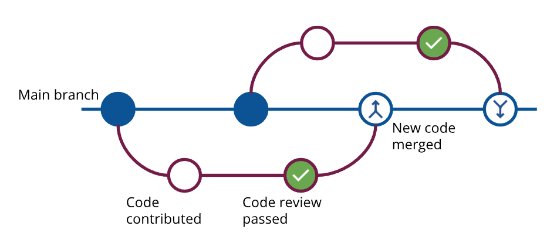

# Quality control

> Control applies to processes, not people. Self-control applies to people.

## Quality philosophy

At Lattice, we define quality in a holistic manner — not just in terms of features of a system, but in terms of its performance, usability, maintainability, reliability and security.

A simple way to understand and measure quality is to ask: _how will this affect my customer?_ The customer can be internal (a colleague), or external (a client or an end-user).

This customer orientation leads us to the following **quality philosophy**:

* Take no error (from my supplier)
* Make no error (at my workstation)
* Pass no error (to my customer)

## From philosophy to framework

To provide structure to our quality philosophy, we first divide it into two categories: extrinsic and intrinsic.

Extrinsic quality is visible when we examine a system from the “outside”. This is what a user sees. Intrinsic quality becomes apparent when we examine the content of our work. This is what a developer sees.

Consider the following: a search feature in a web app does not yield expected results. This impacts extrinsic quality, and such deficiencies are measured by tracking bugs. Bugs are classified by source and severity, enabling us to measure quality at each workstation.

Suppose the search feature worked as expected, but was implemented using a large number of nested loops (high cyclomatic complexity). This makes the code hard to understand and modify, impacting its intrinsic quality. We measure such deficiencies using automated code analysis tools.

Finally, for us to label something as “unexpected”, we have to define what is expected. This is done through scope documents, use cases, navigable prototypes, and test procedures. Taken together, they constitute system specifications.

## Operationalizing the quality framework

The quality framework is made operational via GitHub — the world’s most popular online code repository, built on top of the git version control system (git-vcs). We have been using GitHub to maintain our code and specifications since December 2017.

For each project, we typically create three repositories[^1] — `control`, `frontend`, and `backend`.

### Managing specifications

The `control` repository contains all the specifications. When a specification is created or updated, it is reviewed by project team members before it is queued for development. And any change in code can be traced back to the specification that triggered it. There is **two-way traceability** — from specification to code, and code to specification.

The `control` repository also lists all the tasks, grouped in a parent-child structure. Parent tasks provide a high-level overview of project progress, and child tasks are used by individual contributors—technical architects, developers, designers and quality analysts—to track their work. Tasks are also tracked in GitHub’s project management system, with filters to monitor status and timeliness.

### Addressing errors

The `control` repository logs any bug reports filed by the client, or by the Lattice QA team. If the client reports a bug, then a Quality Analyst reproduces the issue, and attaches images or videos of the error as proof. Codes changes to fix errors reference these bug reports.

Each bug has a 4-level severity rating associated with it:

* **Critical**: A bug that prevents the system from being used, such as failure of the login module, or creates a security vulnerability, such as an exposed encryption key.
* **High**: A bug that affects key features, such as the inability to add a new user to the system.
* **Medium**: A bug that allows invalid data to be added to the system. For example, suppose that 10-digit mobile numbers are required while creating a new user. If the system allows 8-digit numbers to be entered, then such a bug would be classified as a medium severity.
* **Low**: Bugs that do not impede usability, such as incorrect font colors or minor typos.

Bug resolution times vary based on severity, as follows:

* Critical: 8 working hours
* High: 16 working hours
* Medium: 24 working hours
* Low: 40 working hours

Bug fixes are carried out during our business hours: 10 AM to 6 PM IST, Monday to Friday.

### Managing code

The `frontend` and `backend` repositories contain code, build instructions, and scripts that automate deployment.

Whenever code has to be added or updated, it is first added in a branch of the `main` codebase. Isolating the change protects production code, makes the change easier to evaluate, and enables us to connect specification and code at a granular level. This workflow is illustrated below.

<figure><figcaption>
<strong>New code contribution: merging a branch after review</strong>
</figcaption></figure>

Before the code change is merged, it is linked to a "ticket" in the form GitHub issue. This enables specifications changes to be linked to code changes.

Finally, before it is merged, the new code undergoes an automated check that evaluates it on four parameters: security, reliability, maintainability, and duplications. We have zero tolerance for code with security issues—such code is flagged and sent for rework. The same happens if code does meet a pre-determined standard on the other three parameters.

Real-time quality analysis enables us to fix quality issues during development, rather than after deployment—so that our team members “take no error”, “make no error”, and “pass no error”.

## Sustaining and improving quality

Sustaining change, and improving upon it, is only possible when work standards are in place. Standards act as a step on the ladder of improvement.

The quality system described thus far is defined in our work standards, which were first formalized two years after our inception. Since then, they have become a living collection, to which many employees have contributed.

A work standard starts out as a work practice—one person trying something new. If their experiment is successful, they convert it to a work standard. It is then disseminated through the organization by the leadership team, which meets once a week to define the agenda, incorporate new learnings, and monitor implementation.

The reverse also takes place—the management team examines process shortcomings, devises work practices, pilots it in a project, and then converts it into a work standard.

The quality system is also integrated with Lattice’s performance measurement system. Quality is the [single largest parameter](#user-content-fn-2)[^2] used to measure individual and collective performance.

_Photo credit:_ [_Tolga Ulkan_](https://unsplash.com/@tolga__?utm_content=creditCopyText\&utm_medium=referral\&utm_source=unsplash) _on_ [_Unsplash_](https://unsplash.com/photos/yellow-and-brown-leaves-on-white-ceramic-tiles-9k36QqhA0cU?utm_content=creditCopyText\&utm_medium=referral\&utm_source=unsplash)

[^1]: A repository (repo) can be thought of as an access-controlled online folder that has an extensive change management system. Repos can contain code, images, videos, or documents — anything digital.

[^2]: The other three parameters are timeliness, learning & growth, and self-directedness.
